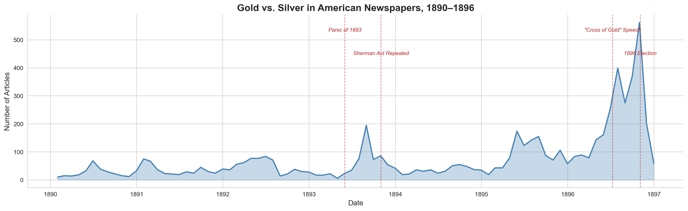
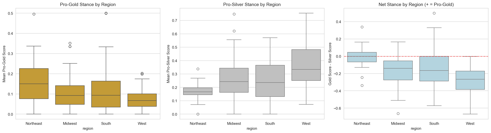
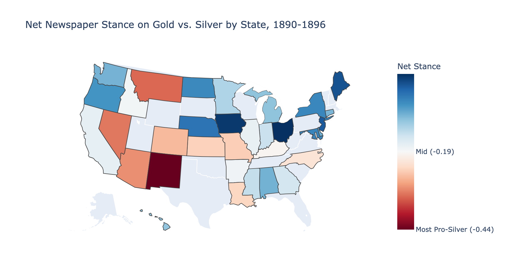

# Newspaper Stance Detection: The Gold vs. Silver Debate in the 1890s

This project uses zero-shot NLI stance detection to measure newspaper-level positions on the gold standard vs. free silver debate during the 1890s, using digitized historical newspaper articles from the American Stories dataset.



## Background

In the 1890s, the U.S. experienced a major political conflict over monetary policy -- the "Battle of the Standards" -- that split along regional rather than partisan lines. Farmers and miners in the South and West supported the free coinage of silver (to inflate prices and ease debts), while the financial community in the Northeast favored maintaining the gold standard (for currency stability). [Shin (2025)](https://sooahnshin.com/issueirt.pdf) uses this debate as a validation case for measuring issue-specific ideal points from roll-call votes, showing that the monetary divide cut across party lines along regional dimensions. Motivated by that work, this project attempts to detect those same regional stances directly in newspaper coverage using NLP methods. The figure above shows the volume of monetary debate coverage across nearly 300 newspapers, with clear spikes around the Panic of 1893, the repeal of the Sherman Silver Purchase Act, and Bryan's 1896 campaign.

## Key Results

We classified 56,355 articles from 298 newspapers across 37 states and found clear geographic patterns consistent with the historical record:

- **Northeast** newspapers show the weakest pro-silver signal (net stance -0.01), with Maine and New Jersey leaning slightly pro-gold. Ohio and Iowa also tilt pro-gold, though each is represented by only one newspaper.
- **South** and **Midwest** newspapers lean moderately pro-silver (net -0.14 and -0.15), reflecting agrarian interests aligned with currency inflation.
- **Western** newspapers are the most strongly pro-silver (net -0.29), led by New Mexico (-0.44), Montana (-0.33), Nevada (-0.32), and Arizona (-0.30) -- mining states with direct economic stakes in silver coinage.

The model's internal validation confirms it is picking up the right signal: articles containing explicitly pro-silver terms (e.g., "free coinage," "silverites") score 2.7x higher on the pro-silver classifier than articles with pro-gold terms (e.g., "sound money," "gold standard").





## Method

1. **Data acquisition**: Download all articles from the [American Stories](https://huggingface.co/datasets/dell-research-harvard/AmericanStories) dataset (1890-1896) and filter for articles about the monetary standard debate using 27 domain-specific keywords.
2. **Stance detection**: Apply the [Political DEBATE](https://huggingface.co/mlburnham/Political_DEBATE_large_v1.0) zero-shot NLI model to classify each article's stance toward the gold standard and toward free silver independently.
3. **Aggregation**: Roll up article-level stance scores to the newspaper level, then examine geographic patterns using Library of Congress metadata.

## Project Structure

```
newspaper_stances/
├── notebooks/
│   ├── 01_data_acquisition.ipynb       # Download & filter American Stories
│   ├── 02_explore_filtered_data.ipynb  # EDA on gold/silver articles
│   ├── 03_stance_detection.ipynb       # Apply Political DEBATE model
│   └── 04_aggregation_analysis.ipynb   # Newspaper-level results + geo
├── src/
│   ├── data_utils.py                   # Download/filtering helpers
│   ├── stance_model.py                 # Political DEBATE wrapper
│   └── geo_lookup.py                   # LCCN to geography crosswalk
├── data/
│   ├── american_stories/               # Filtered articles (parquet)
│   ├── lccn_metadata/                  # Geographic crosswalk data
│   └── results/                        # Stance detection outputs
├── requirements.txt
└── README.md
```

## Data Sources

- **American Stories**: Dell et al. (2023), hosted on HuggingFace. A large-scale structured text dataset of historical U.S. newspapers derived from Library of Congress scans.
- **Political DEBATE**: Burnham et al. (2025). A RoBERTa-large NLI model trained on political text for zero-shot and few-shot classification.
- **Library of Congress**: LCCN metadata API for newspaper geographic information.

## Usage

```bash
pip install -r requirements.txt
```

Then run notebooks in order: `01_data_acquisition.ipynb` -> `02_explore_filtered_data.ipynb` -> `03_stance_detection.ipynb` -> `04_aggregation_analysis.ipynb`.

## Known Limitations

- **Pro-gold asymmetry.** The model detects pro-silver rhetoric more readily than pro-gold (mean score 0.27 vs. 0.13). Gold standard defenders often used implicit, status-quo framing that may not trigger the zero-shot hypothesis "This text supports the gold standard" as strongly. This is a known challenge with NLI-based stance detection on establishment positions.
- **Low-count states.** Six states (Ohio, Iowa, Oregon, Idaho, Nevada, Hawaii) are represented by a single newspaper each. Their stance estimates carry high variance and should be treated cautiously.
- **Missing states.** Sixteen states and territories lack any newspaper coverage in the filtered dataset, including several historically significant ones: Pennsylvania, Massachusetts, Virginia, Texas, Tennessee, and South Carolina. The Northeast remains underrepresented overall (25 newspapers vs. 96 Midwest, 98 South, 70 West), meaning the region most associated with pro-gold sentiment has the thinnest coverage.
- **OCR noise.** The American Stories data is derived from digitized newspaper scans. OCR errors in 1890s print may cause some relevant articles to be missed by keyword filtering or misclassified by the stance model.

## References

- Burnham, M., Kahn, K., Wang, R. Y., & Peng, R. X. (2025). "Political DEBATE: Efficient Zero-Shot and Few-Shot Classifiers for Political Text." *Political Analysis*. https://doi.org/10.1017/pan.2025.10028
- Dell, M., Carlson, J., Bryan, T., Silcock, E., Arora, A., Shen, Z., D'Amico-Wong, L., Le, Q., Querubin, P., & Heldring, L. (2023). "American Stories: A Large-Scale Structured Text Dataset of Historical U.S. Newspapers." *NeurIPS 2023 Datasets and Benchmarks*. https://arxiv.org/abs/2308.12477
- Shin, S. (2025). "Measuring Issue Specific Ideal Points from Roll Call Votes." Working paper.
- Frieden, J. (2016). *Currency Politics: The Political Economy of Exchange Rate Policy*.
- Bensel, R. (2000). *The Political Economy of American Industrialization, 1877-1900*.
