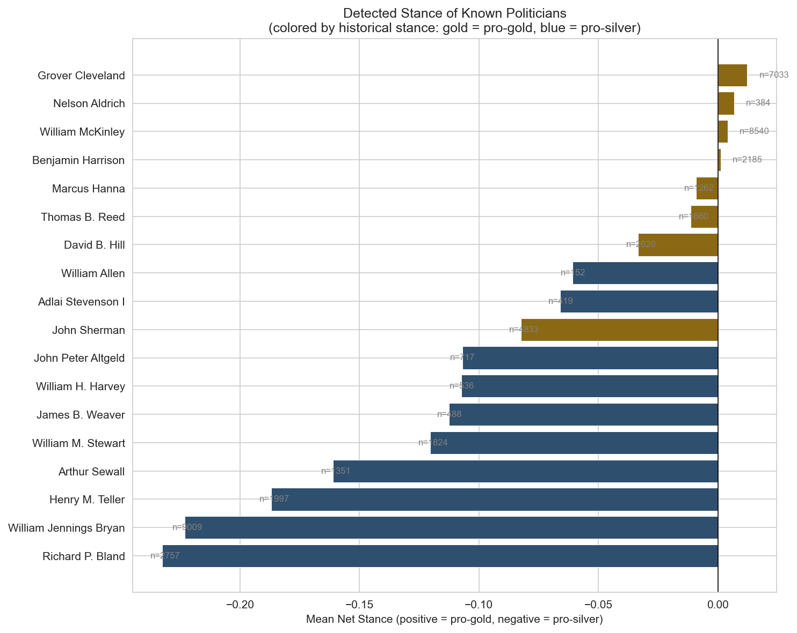
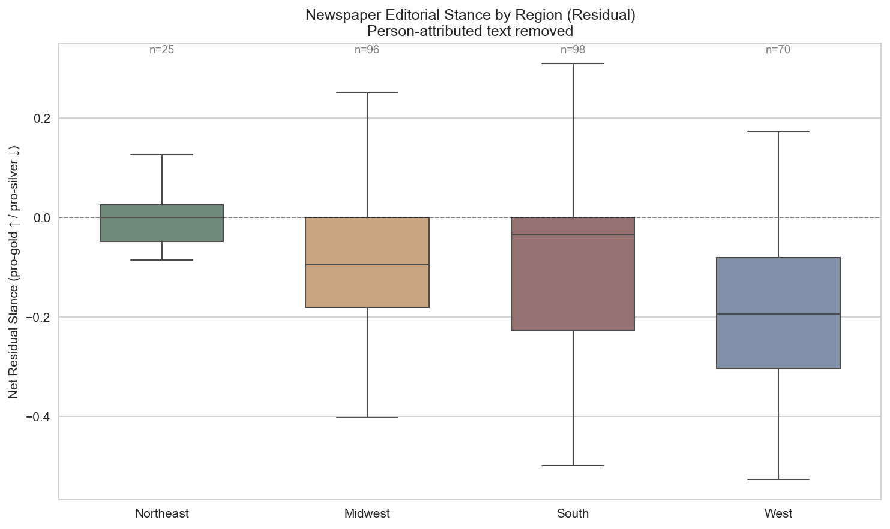
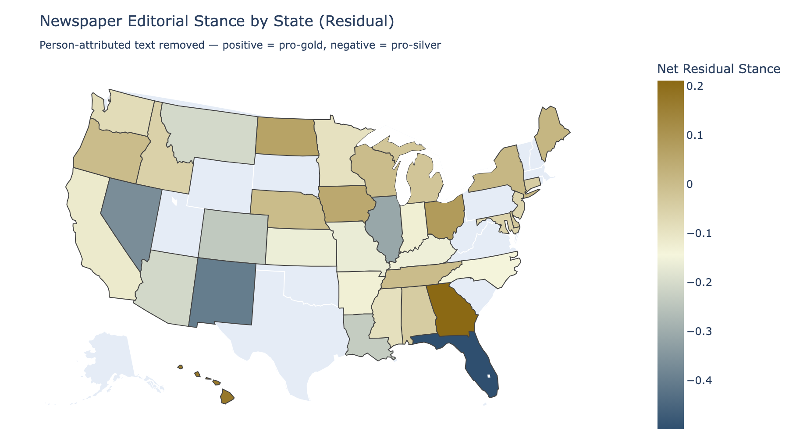

# Newspaper Stance Detection: The Gold vs. Silver Debate in the 1890s

This project uses zero-shot NLI stance detection to measure newspaper-level positions on the gold standard vs. free silver debate during the 1890s, using digitized historical newspaper articles from the American Stories dataset.


## Background

In the 1890s, the U.S. experienced a major political conflict over monetary policy -- the "Battle of the Standards" -- that split along regional rather than partisan lines. Farmers and miners in the South and West supported the free coinage of silver (to inflate prices and ease debts), while the financial community in the Northeast favored maintaining the gold standard (for currency stability). [Shin (2025)](https://sooahnshin.com/issueirt.pdf) uses this debate as a validation case for measuring issue-specific ideal points from roll-call votes, showing that the monetary divide cut across party lines along regional dimensions. Motivated by that work, this project attempts to detect those same regional stances directly in newspaper coverage using NLP methods. The figure above shows the volume of monetary debate coverage across nearly 300 newspapers, with clear spikes around the Panic of 1893, the repeal of the Sherman Silver Purchase Act, and Bryan's 1896 campaign.

## Key Results

We classified 56,355 articles from 298 newspapers across 37 states and found clear geographic patterns consistent with the historical record:

- **Northeast** newspapers show the weakest pro-silver signal (net stance -0.01), with Maine and New Jersey leaning slightly pro-gold. Ohio and Iowa also tilt pro-gold, though each is represented by only one newspaper.
- **South** and **Midwest** newspapers lean moderately pro-silver (net -0.14 and -0.15), reflecting agrarian interests aligned with currency inflation.
- **Western** newspapers are the most strongly pro-silver (net -0.29), led by New Mexico (-0.44), Montana (-0.33), Nevada (-0.32), and Arizona (-0.30) -- mining states with direct economic stakes in silver coinage.

The model's internal validation confirms it is picking up the right signal: articles containing explicitly pro-silver terms (e.g., "free coinage," "silverites") score 2.7x higher on the pro-silver classifier than articles with pro-gold terms (e.g., "sound money," "gold standard").


## Entity-Level Analysis: Separating Newspaper Slant from Reported Speech

An article classified as "pro-silver" might reflect the newspaper's own editorial position, or it might simply be reporting on a pro-silver politician like Bryan. To disentangle these, we split each article into sentences, identify person mentions (using a lookup table of 18 key 1890s political figures plus a general name-detection heuristic), and run stance detection separately on person-attributed sentences and the residual text.

### Person-level stance detection

For sentences mentioning a known politician, we use person-specific hypotheses (e.g., "According to this text, Bryan supports the free coinage of silver") to measure how each figure is *portrayed* in newspaper coverage. The model correctly classifies 14 of 18 known politicians by their historical stance (77.8% accuracy for figures with 5+ article mentions). The top pro-gold figures by detected stance are Grover Cleveland (+0.012), Nelson Aldrich (+0.007), and William McKinley (+0.004). The top pro-silver figures are Richard P. Bland (-0.233), William Jennings Bryan (-0.223), and Henry Teller (-0.187).

The four misclassified politicians (Marcus Hanna, Thomas Reed, David Hill, John Sherman) are all pro-gold figures whose detected stances are slightly negative. This is consistent with the model's known pro-gold detection asymmetry: gold-standard defenders used less overt language, and the model's person-specific hypotheses inherit that same bias.



### Residual newspaper stance

After removing person-attributed sentences, the remaining "residual" text captures the newspaper's own editorial voice. Comparing original and residual article-level stances across 54,024 articles:

- The two measures correlate at r = 0.628, meaning they are related but meaningfully different.
- The residual stance shifts +0.044 toward gold on average, suggesting that some of the measured pro-silver signal in the original scores came from newspapers *reporting on* pro-silver politicians rather than *endorsing* silver themselves.
- At the newspaper level (300 newspapers), the correlation is higher (r = 0.813) and the shift is +0.033.

The regional pattern holds under the residual measure, but is somewhat attenuated, consistent with the interpretation that the original scores conflated editorial slant with reported speech.





## Discussion

### Silver mining and pro-silver sentiment

The strongest pro-silver newspaper stances come from the country's major silver-producing states. Nevada (the Comstock Lode), Montana (Butte, Phillipsburg), Colorado (Leadville), Idaho (Coeur d'Alene), Arizona, and New Mexico were all centers of silver mining in the 1890s. In the data, these are almost exactly the most pro-silver states: New Mexico (-0.44), Montana (-0.33), Nevada (-0.32), Arizona (-0.31), Colorado (-0.27), Idaho (-0.18). The correlation between silver production and newspaper stance is nearly monotonic. For these states, the free coinage of silver was not an abstract monetary philosophy -- it was directly tied to the local economy. When Congress repealed the Sherman Silver Purchase Act in 1893, Colorado's mining industry collapsed and its economy was devastated.

### The South: pro-silver, but not uniformly

Southern newspapers lean pro-silver on average (net -0.14), consistent with the region's agrarian-populist coalition that saw currency inflation as relief from crushing debt. However, the South shows a notable internal gradient. Border states with closer ties to Northeastern financial networks are nearly neutral: Maryland (-0.02), Delaware (-0.06). The deeper South leans more strongly: Louisiana (-0.24), North Carolina (-0.22), Kentucky (-0.19), Arkansas (-0.18). This gradient is consistent with the geographic and economic logic of the silver movement: the further a state's economy was from Northeastern banking interests and the more it depended on agriculture, the stronger its pro-silver signal.

### The Northeast: quiet on gold

The Northeast shows the weakest stance signal of any region (net -0.01), which is consistent with its historical alignment as the center of gold-standard support but may also understate pro-gold sentiment for two reasons:

1. **Coverage gaps.** The dataset contains only 25 Northeastern newspapers (vs. 96 Midwest, 98 South, 70 West). Several key states are missing entirely, including Pennsylvania, Massachusetts, and Virginia. The financial centers most associated with gold-standard advocacy (New York, Boston, Philadelphia) are either absent or very thinly represented. New York has only three newspapers in the dataset.

2. **Status-quo framing.** The model's pro-gold detection asymmetry (2.7x weaker than pro-silver) may disproportionately affect Northeastern coverage. Gold-standard defenders often relied on implicit framing -- "sound money," "fiscal responsibility" -- rather than overt advocacy. A newspaper that covered the silver movement dismissively, treating the gold standard as the obvious default, would register as nearly neutral under the model's NLI hypotheses. The pro-silver movement was insurgent, and insurgent rhetoric is louder and more lexically distinctive. This asymmetry likely compresses the measured pro-gold signal in precisely the region where it should be strongest.

### Why silver lost despite its popularity

The newspaper data reveals broad pro-silver sentiment across most of the country, which raises a natural question: why did the United States maintain the gold standard?

The 1896 presidential election provides the clearest answer. William Jennings Bryan won the South and West decisively on a free-silver platform, but William McKinley carried the more populous, industrialized states of the Northeast and upper Midwest (Ohio, Indiana, Illinois, Wisconsin, Minnesota, Iowa). Bryan won more states geographically, but fewer electoral votes. The electoral college math favored the regions where gold-standard sentiment was concentrated.

Beyond the election, the financial establishment held structural advantages. Eastern banks, railroads, and bondholders had enormous influence over both parties' institutional leadership. Gold Democrats in the Northeast (led by President Grover Cleveland) had spent much of the early 1890s actively fighting silver within their own party -- the repeal of the Sherman Silver Purchase Act in 1893 happened under a Democratic president. Internationally, the gold standard was the norm among major trading partners, especially Britain, and unilateral departure carried real risks for trade and investment.

The newspaper map shows where popular sentiment was concentrated. It does not show where institutional and electoral power was concentrated. That gap between the geographic breadth of pro-silver support and the political power of the pro-gold minority is itself a notable feature of the 1890s monetary debate, and one that echoes in other historical cases where insurgent movements with broad geographic support were outweighed by concentrated institutional power.

## Method

1. **Data acquisition**: Download all articles from the [American Stories](https://huggingface.co/datasets/dell-research-harvard/AmericanStories) dataset (1890-1896) and filter for articles about the monetary standard debate using 27 domain-specific keywords.
2. **Stance detection**: Apply the [Political DEBATE](https://huggingface.co/mlburnham/Political_DEBATE_large_v1.0) zero-shot NLI model to classify each article's stance toward the gold standard and toward free silver independently.
3. **Aggregation**: Roll up article-level stance scores to the newspaper level, then examine geographic patterns using Library of Congress metadata.
4. **Entity-level analysis** (notebook 05): Use nltk sentence splitting and regex-based entity matching to identify people mentioned within articles, disambiguate against a table of ~18 known 1890s political figures, and run stance detection at the entity level using person-specific hypotheses (e.g., "According to this text, Bryan supports free silver"). Sentences mentioning people are separated from residual text, enabling both person-level stance measurement and a cleaner estimate of newspaper editorial slant net of attributed speech.

## Project Structure

```
newspaper_stances/
├── notebooks/
│   ├── 01_data_acquisition.ipynb       # Download & filter American Stories
│   ├── 02_explore_filtered_data.ipynb  # EDA on gold/silver articles
│   ├── 03_stance_detection.ipynb       # Apply Political DEBATE model
│   ├── 04_aggregation_analysis.ipynb   # Newspaper-level results + geo
│   └── 05_entity_stance_analysis.ipynb # Entity-level stance detection
├── src/
│   ├── data_utils.py                   # Download/filtering helpers
│   ├── stance_model.py                 # Political DEBATE wrapper
│   ├── geo_lookup.py                   # LCCN to geography crosswalk
│   └── entity_extraction.py            # NER + politician disambiguation
├── data/
│   ├── american_stories/               # Filtered articles (parquet)
│   ├── lccn_metadata/                  # Geographic crosswalk data
│   └── results/                        # Stance detection outputs
├── requirements.txt
└── README.md
```

## Data Sources

- **American Stories**: Dell et al. (2023), hosted on HuggingFace. A large-scale structured text dataset of historical U.S. newspapers derived from Library of Congress scans.
- **Political DEBATE**: Burnham et al. (2025). A RoBERTa-large NLI model trained on political text for zero-shot and few-shot classification.
- **Library of Congress**: LCCN metadata API for newspaper geographic information.

## Usage

```bash
pip install -r requirements.txt
```

Then run notebooks in order: `01_data_acquisition.ipynb` -> `02_explore_filtered_data.ipynb` -> `03_stance_detection.ipynb` -> `04_aggregation_analysis.ipynb` -> `05_entity_stance_analysis.ipynb`.

Notebook 05 includes a checkpoint system: the entity-level and residual stance detection cells auto-save results to `data/results/` when they complete. A load-from-checkpoint cell before section 6 lets you skip the expensive detection steps on subsequent runs.

## Known Limitations

- **Pro-gold asymmetry.** The model detects pro-silver rhetoric more readily than pro-gold (mean score 0.27 vs. 0.13). Gold standard defenders often used implicit, status-quo framing that may not trigger the zero-shot hypothesis "This text supports the gold standard" as strongly. This is a known challenge with NLI-based stance detection on establishment positions.
- **Low-count states.** Six states (Ohio, Iowa, Oregon, Idaho, Nevada, Hawaii) are represented by a single newspaper each. Their stance estimates carry high variance and should be treated cautiously.
- **Missing states.** Sixteen states and territories lack any newspaper coverage in the filtered dataset, including several historically significant ones: Pennsylvania, Massachusetts, Virginia, Texas, Tennessee, and South Carolina. The Northeast remains underrepresented overall (25 newspapers vs. 96 Midwest, 98 South, 70 West), meaning the region most associated with pro-gold sentiment has the thinnest coverage.
- **OCR noise.** The American Stories data is derived from digitized newspaper scans. OCR errors in 1890s print may cause some relevant articles to be missed by keyword filtering or misclassified by the stance model.

## References

- Burnham, M., Kahn, K., Wang, R. Y., & Peng, R. X. (2025). "Political DEBATE: Efficient Zero-Shot and Few-Shot Classifiers for Political Text." *Political Analysis*. https://doi.org/10.1017/pan.2025.10028
- Dell, M., Carlson, J., Bryan, T., Silcock, E., Arora, A., Shen, Z., D'Amico-Wong, L., Le, Q., Querubin, P., & Heldring, L. (2023). "American Stories: A Large-Scale Structured Text Dataset of Historical U.S. Newspapers." *NeurIPS 2023 Datasets and Benchmarks*. https://arxiv.org/abs/2308.12477
- Shin, S. (2025). "Measuring Issue Specific Ideal Points from Roll Call Votes." Working paper.
- Frieden, J. (2016). *Currency Politics: The Political Economy of Exchange Rate Policy*.
- Bensel, R. (2000). *The Political Economy of American Industrialization, 1877-1900*.
